# Hi, I'm Philip Lee

I build websites and internal tools that small businesses can actually run.

Most of my recent work is for **Fraca Servcom Ltd** in Eldoret: a public catalog at [fracaservcom.co.ke](https://fracaservcom.co.ke), plus a staff-only Laravel sales book so reception can record cash, M-Pesa, and invoices instead of treating a WhatsApp inquiry as a sale.

I started with HTML, CSS, and JavaScript. The inventory system is where I got serious about PHP, Laravel, and shaping software around how a shop already works.

## Socials

## What I ship

| Project | What I learned |
| --- | --- |
| [Fraca inventory & sales book](https://github.com/PhilipLee2002/fraca-inventory-system) | Laravel, staff auth, sales flow, payments (cash / M-Pesa / bank), printable invoices, SQLite → MySQL |
| [Fraca Servcom website](https://fracaservcom.co.ke) | Responsive catalog site for a real shop — furniture and bags, WhatsApp and contact, not a fake portfolio mock |
| [Lashed by Lorah](https://github.com/PhilipLee2002/Lashed-by-Lorah) | Client site from HTML and CSS — layout, copy, and a service business on the web |
| [Poster designs](https://github.com/PhilipLee2002/Poster-designs) | Visual hierarchy and brand layouts in Canva |
| [Task Manager](https://github.com/PhilipLee2002/Task-Manager-JS-practice) | First JavaScript project — DOM, state on the page, the basics before Laravel |
| [Portfolio (in progress)](https://github.com/PhilipLee2002/MyMainPortfolio) | Next.js, React, TypeScript, Tailwind — still learning this stack, not claiming mastery yet |

## Stack I am actually good with

Things I have used to ship work, not a list of logos I liked in a generator.

**Languages & markup**

**I ship with these**

**Daily tools**

## Currently learning

I am building a portfolio in this stack. Comfortable enough to make things; not putting it next to Laravel as if they were equal.

## GitHub stats

These cards are generated in this repo (not the public Vercel demo, which is often down).

  
  

